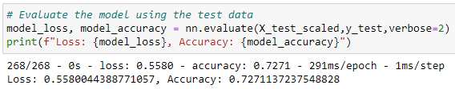
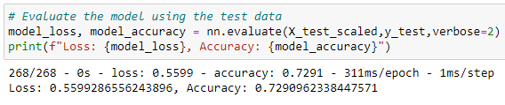
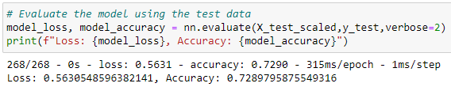
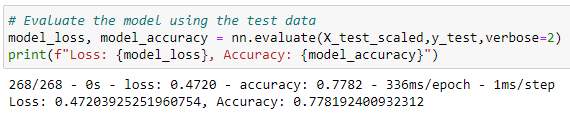

# Neural_Network_Charity_Analysis

## Overview of the Analysis
The purpose of this analysis was to develop a deep learning model using a neural network to predict whether applicants to AlphabetSoup would be successful if funded. The goal was to optimize the model's performance and achieve a predictive accuracy higher than 75%.

## Results

### Preprocessing Data for a Neural Network Model
- **Target Variable**: "IS_SUCCESSFUL"
- **Features**: Various columns such as "APPLICATION_TYPE," "AFFILIATION," "CLASSIFICATION," and others.
- **Columns Removed**: - Deliverable 1/2: "EIN" and "NAME", Deliverable 3: "EIN"

### Compiling, Training, and Evaluating the Model
- **AlphabetSoupCharity**
  - Number of neurons: Layer 1 - 80, Layer 2 - 30
  - Activation Functions: All layers - relu
  - Target Model Performance: 72.71%
  
  

### Optimize the Model
- **Attempt 1**
  - Number of Neurons: Layer 1 - 80, Layer 2 - 40, Layer 3 - 20
  - Activation Functions: Layer 1 - ReLU, Layer 2 - tanh, Layer 3 - sigmoid
  - Accuracy: 72.91%
  
  

- **Attempt 2**
  - Number of Neurons: Layer 1 - 200, Layer 2 - 150, Layer 3 - 100, Layer 4 - 50
  - Activation Functions: All layers - tanh
  - Accuracy: 72.9%
  
  

- **Final Attempt (3)**
  - Number of Neurons: Layer 1 - 125, Layer 2 - 50, Layer 3 - 20, Layer 4 - 10
  - Activation Functions: All layers - tanh
  - Accuracy: 77.82%
  
  

## Summary
In summary, the deep learning model using a neural network showed improvements in performance through optimization attempts. The best model achieved an accuracy of 77.82%, surpassing the target of 75% accuracy. Several modifications were made to the model architecture, including adjusting the input data, adding more neurons and hidden layers, and changing the activation functions.

## Recommendation
Considering the results and the classification problem at hand, an alternative model that could potentially provide better performance is the Random Forest classifier. Random Forest is an ensemble learning method that combines multiple decision trees to make predictions. It can handle high-dimensional data, capture complex interactions, and handle both numerical and categorical features effectively.

By utilizing Random Forest, we can benefit from its ability to handle feature interactions and provide feature importances, allowing for better interpretability. Additionally, Random Forest is less prone to overfitting and can handle imbalanced datasets. With further experimentation and tuning, the Random Forest model may yield higher accuracy and better performance for the loan prediction risk analysis.
